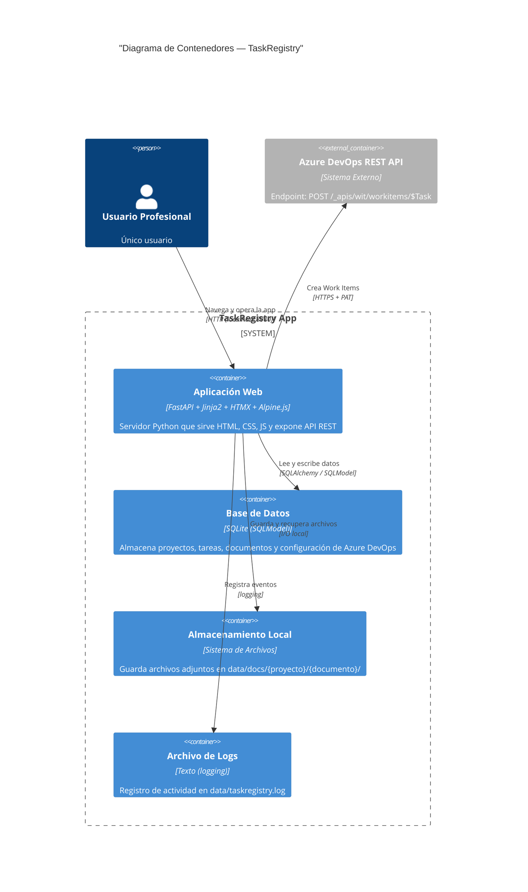
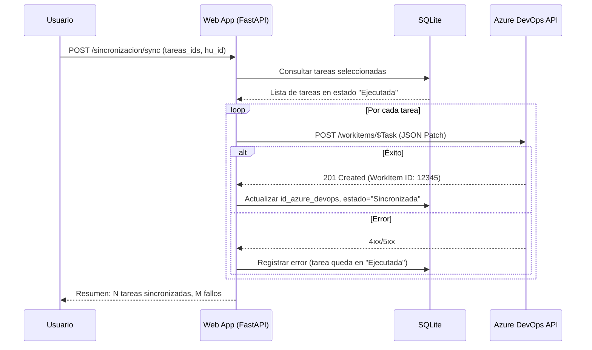

# Diagrama de Contenedores (C4 Nivel 2)

> Muestra los contenedores (aplicaciones, bases de datos, etc.) dentro del sistema TaskRegistry y sus interacciones.



## Detalle de contenedores

### Aplicación Web (FastAPI)
| Aspecto | Descripción |
|---------|-------------|
| Puerto | `8080` (localhost) |
| Templates | Jinja2 con layouts reutilizables |
| Interactividad | HTMX para actualizaciones parciales, Alpine.js para estado local |
| Endpoints | RESTful, documentados automáticamente en `/docs` (Swagger) |
| Dependencias principales | `fastapi`, `uvicorn`, `sqlmodel`, `httpx` (para Azure API), `python-multipart` (para subida archivos) |

### Base de Datos (SQLite)
| Aspecto | Descripción |
|---------|-------------|
| Archivo | `data/taskregistry.db` |
| Tablas | `proyectos`, `tareas`, `documentos`, `archivos_adjuntos`, `configuracion_azure` |
| Migraciones | Alembic (vía SQLModel) |
| Backup | Copiar el archivo `.db` |

### Almacenamiento Local (Archivos)
| Aspecto | Descripción |
|---------|-------------|
| Ruta base | `data/docs/` |
| Estructura | `{proyecto_id}/{documento_id}/{archivo}` |
| Límite | 50 MB por archivo (MVP) |

## Flujo de sincronización (secuencia)



## Distribución física

```
Máquina local (Windows)
│
├── 🖥️  Navegador (Chrome/Edge/Firefox)
│
└── 🐍 Python 3.12+
    └── TaskRegistry App (FastAPI en localhost:8080)
        ├── 📄 data/taskregistry.db       (SQLite)
        ├── 📁 data/docs/                 (Archivos adjuntos)
        └── 📄 data/taskregistry.log      (Logs)
```
