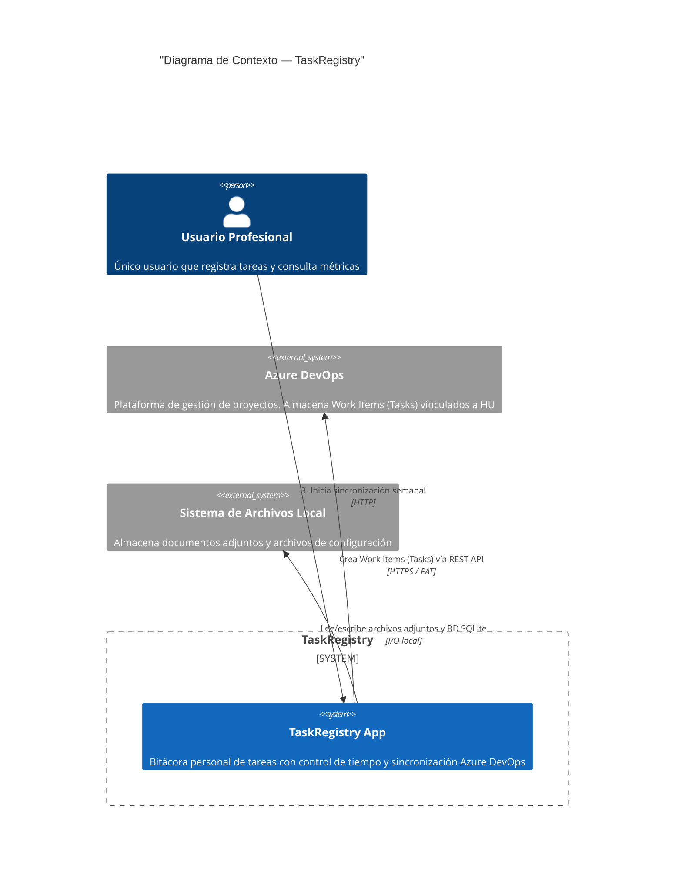

# Diagrama de Contexto (C4 Nivel 1)

> Muestra el sistema TaskRegistry y sus interacciones con actores y sistemas externos.

## Descripción de elementos

| Elemento | Descripción |
|----------|-------------|
| **Usuario Profesional** | Actor único. Usuario técnico que opera la app localmente. No hay autenticación ni roles. |
| **TaskRegistry App** | Sistema principal. Servidor web Python (FastAPI) corriendo en localhost. Sirve HTML con Jinja2 + HTMX + Alpine.js. |
| **Azure DevOps** | Sistema externo. Recibe tareas vía REST API para crear Work Items de tipo Task. |
| **Sistema de Archivos Local** | Almacenamiento local de la BD SQLite y los archivos adjuntos de documentos. |

## Flujo principal

1. El usuario accede desde el navegador a `http://localhost:8080`
2. Gestiona proyectos, registra tareas con tiempos y adjunta documentación
3. Al final de la semana, selecciona tareas en estado `Ejecutada` e inicia sincronización
4. La app crea Work Items en Azure DevOps y marca las tareas como `Sincronizada`
5. El tablero de control muestra métricas agregadas por proyecto y rango de fechas
