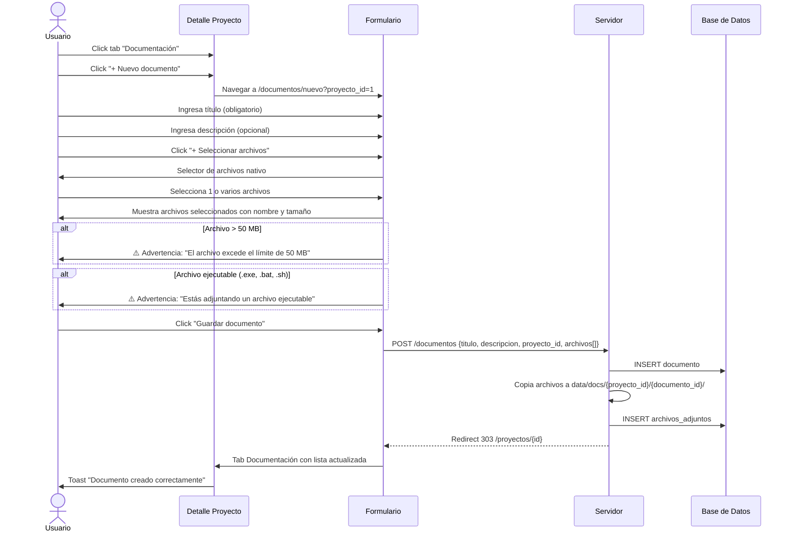
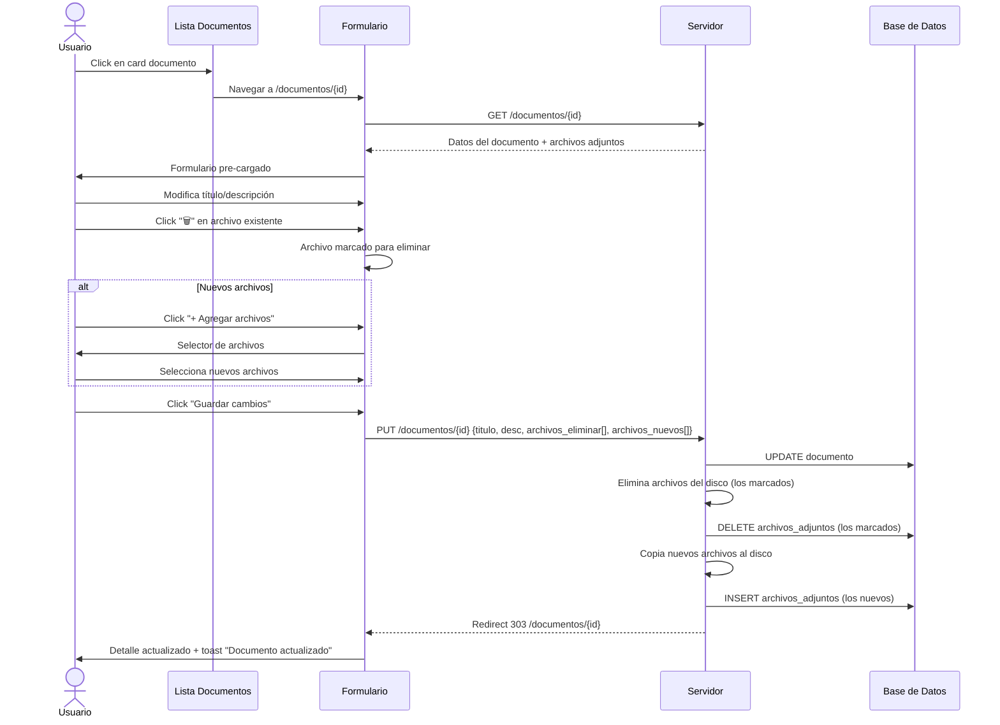
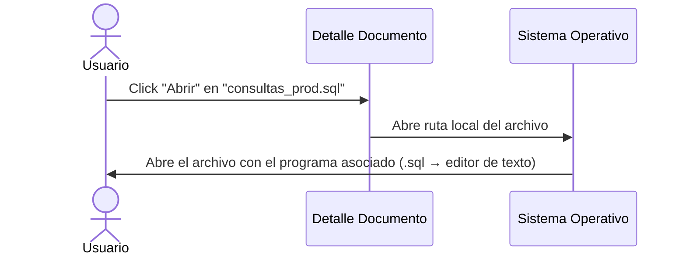
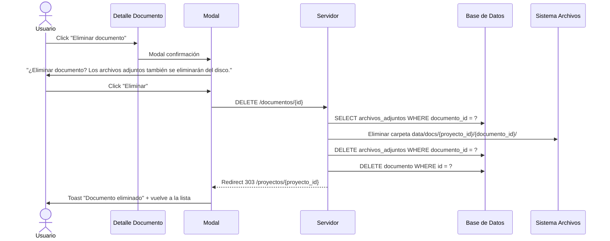

# Flujos de Navegación — Módulo Documentación

> Diagramas de interacción para la gestión de documentos de proyectos.

---

## Índice

- [Flujo General](#flujo-general)
- [Flujo: Crear Documento](#flujo-crear-documento)
- [Flujo: Editar Documento](#flujo-editar-documento)
- [Flujo: Abrir Archivo Adjunto](#flujo-abrir-archivo-adjunto)
- [Flujo: Eliminar Documento](#flujo-eliminar-documento)

---

## Flujo General

```mermaid
graph TD
    A[Detalle Proyecto] --> B[Tab "Tareas"]
    A --> C[Tab "Documentación"]
    
    C --> D[Lista de Documentos]
    
    D --> E[Click "+ Nuevo documento"]
    E --> F[Formulario Crear]
    F -->|Guardar| G[Toast "Documento creado"]
    G --> D
    F -->|Cancelar| D
    
    D --> H[Click en card documento]
    H --> I[Detalle/Edición Documento]
    
    I --> J[Modificar campos]
    J -->|Guardar| K[Toast "Documento actualizado"]
    K --> I
    
    I --> L[Agregar archivo]
    L --> M[Selector de archivos nativo]
    M --> N[Lista de archivos actualizada]
    N --> J
    
    I --> O[Click "Abrir" en archivo]
    O --> P[Abre con programa asociado del SO]
    
    I --> Q[Click "Eliminar" en archivo]
    Q --> R[Archivo eliminado de la lista]
    
    I --> S[Click "Eliminar documento"]
    S --> T[Modal confirmación]
    T -->|Confirmar| U[Toast "Documento eliminado"]
    U --> D
    T -->|Cancelar| I
```

---

## Flujo: Crear Documento



---

## Flujo: Editar Documento



---

## Flujo: Abrir Archivo Adjunto



> **Nota:** No hay llamada al servidor. Es un enlace directo al archivo local (`file:///...`).

---

## Flujo: Eliminar Documento



---

## Estados de cada pantalla

| Pantalla | Estados |
|----------|---------|
| **Lista documentos (en proyecto)** | Carga → Vacío (sin documentos) → Lista con datos → Error |
| **Detalle/edición documento** | Carga → Formulario editable → Error (documento no encontrado) |
| **Crear documento** | Inicial → Con archivos seleccionados → Guardando → Éxito → Error |

---

## Documentos relacionados

- [Design System](./UI-design-system.md) — Guía de estilos y componentes
- [Mockups del Módulo Documentación](./UI-mockups-documentacion.md) — Wireframes detallados
- [Mockups del Módulo Proyectos](./UI-mockups-proyectos.md) — Vista de detalle donde se integran los tabs
- [Reglas de Negocio](../general/06-Reglas-Negocio.md) — Reglas RN-8, RN-9, RN-17

---

> **Última actualización:** 22/06/2026  
> **Versión:** 1.0  
> **Estado:** Pendiente de aprobación
