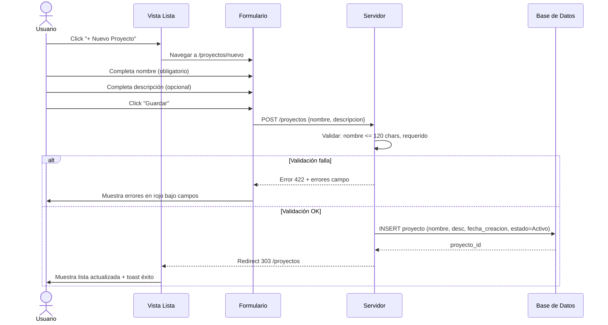
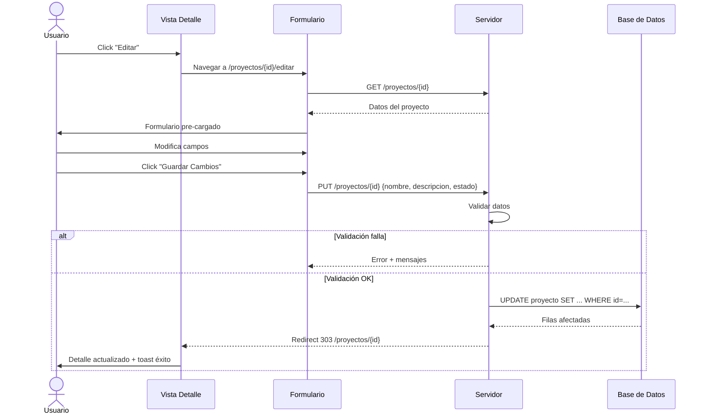
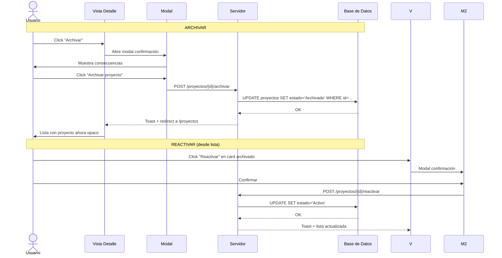
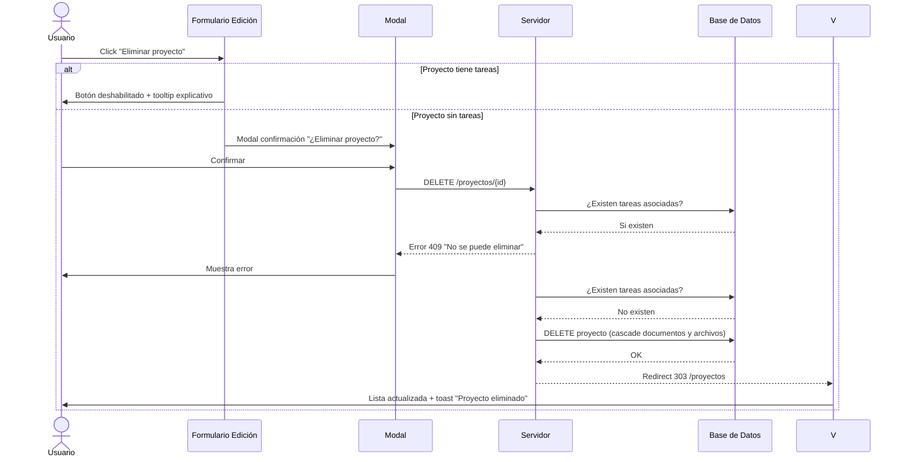
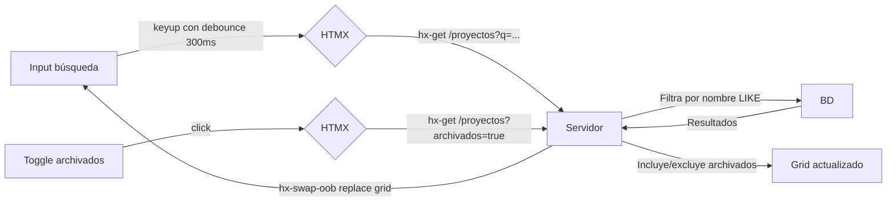

# Flujos de Navegación — Módulo Proyectos

> Diagramas de navegación e interacción para el módulo de Gestión de Proyectos.

---

## Índice

- [Flujo General del Módulo](#flujo-general-del-módulo)
- [Flujo: Crear Proyecto](#flujo-crear-proyecto)
- [Flujo: Editar Proyecto](#flujo-editar-proyecto)
- [Flujo: Archivar / Reactivar Proyecto](#flujo-archivar--reactivar-proyecto)
- [Flujo: Eliminar Proyecto](#flujo-eliminar-proyecto)
- [Flujo: Buscar y Filtrar](#flujo-buscar-y-filtrar)
- [Micro-interacciones](#micro-interacciones)

---

## Flujo General del Módulo

```mermaid
graph TD
    A[Sidebar: Click "Proyectos"] --> B[Vista Lista Proyectos]
    
    B --> C[Click "Búsqueda"]
    C --> B
    
    B --> D[Toggle Archivados]
    D --> B
    
    B --> E[Click "+ Nuevo"]
    E --> F[Formulario Crear Proyecto]
    F -->|Guardar éxito| G[Toast: "Proyecto creado"]
    G --> B
    F -->|Cancelar| B
    
    B --> H[Click Card Proyecto]
    H --> I[Vista Detalle Proyecto]
    
    I --> J[Click tab Tareas]
    J --> K[Tab Tareas - contenido HTMX]
    
    I --> L[Click tab Documentación]
    L --> M[Tab Documentación - contenido HTMX]
    
    I --> N[Click "Editar"]
    N --> O[Formulario Editar Proyecto]
    O -->|Guardar| P[Toast: "Proyecto actualizado"]
    P --> I
    O -->|Cancelar| I
    
    I --> Q[Click "Archivar"]
    Q --> R[Modal Confirmación Archivar]
    R -->|Cancelar| I
    R -->|Confirmar| S[Toast: "Proyecto archivado"]
    S --> B
    
    B --> T[Proyecto Archivado - Click "Reactivar"]
    T --> U[Modal Confirmación Reactivar]
    U -->|Confirmar| V[Toast: "Proyecto reactivado"]
    V --> B
```

---

## Flujo: Crear Proyecto



### Reglas de UI

| Regla | Descripción |
|-------|-------------|
| **Validación en cliente** | Maxlength en input nombre, required attribute. |
| **Validación en servidor** | FastAPI + Pydantic validan nombre requerido y longitud. |
| **Feedback visual** | Borde rojo en input inválido + mensaje de error debajo. |
| **Éxito** | Toast verde "Proyecto creado correctamente" + lista actualizada. |
| **Redirección** | Después de guardar, redirige a lista de proyectos (no al detalle). |

---

## Flujo: Editar Proyecto



---

## Flujo: Archivar / Reactivar Proyecto



### Estados del modal de archivar

| Elemento | Estado |
|----------|--------|
| **Título** | `¿Archivar "{nombre}"?` |
| **Cuerpo** | Lista de consecuencias con iconos check |
| **Botón archivar** | `bg-emerald-600 hover:bg-emerald-700` |
| **Botón cancelar** | `btn-secondary` |
| **Cerrar** | Click overlay, Escape key, botón X |

---

## Flujo: Eliminar Proyecto



---

## Flujo: Buscar y Filtrar



### Especificaciones de búsqueda

| Elemento | Detalle |
|----------|---------|
| **Disparador** | `keyup` con debounce de 300ms para no saturar el servidor. |
| **Mecanismo** | HTMX `hx-get` con `hx-trigger="keyup changed delay:300ms"`. |
| **Target** | `hx-target="#project-grid"` + `hx-swap="outerHTML"`. |
| **Toggle archivados** | Envía query param `?archivados=1` al mismo endpoint. |

---

## Micro-interacciones

| Interacción | Comportamiento | CSS/JS |
|-------------|---------------|--------|
| **Hover en card** | Sombra pasa de `shadow-sm` a `shadow-md`, leve elevación (translateY -2px). | `transition-all duration-200` + `hover:-translate-y-0.5 hover:shadow-md` |
| **Hover en sidebar item** | Fondo `indigo-50` (claro) / `slate-700` (oscuro). | `hover:bg-indigo-50 dark:hover:bg-slate-700` |
| **Sidebar colapsar/expandir** | Transición suave de 200ms. Iconos + tooltips al colapsar. | `transition-all duration-200` con Alpine.js para toggle de clase `.collapsed` |
| **Badge estado** | Aparece con fade-in al cargar la página. | Transición de opacidad. |
| **Toast notificación** | Aparece deslizándose desde la derecha, desaparece a los 4 segundos con fade-out. | Alpine.js + `x-transition:enter` |
| **Toggle archivados** | Color de fondo cambia suavemente de slate a indigo. El dot se desliza. | `transition-colors duration-200` + `transition-transform duration-200` |
| **Click en card** | Feedback visual con ring indigo-500 al hacer clic (active state). | `active:ring-2 active:ring-indigo-500` |
| **Input focus** | Borde cambia de slate-300 a indigo-500 con ring de 2px. | `focus:outline-none focus:ring-2 focus:ring-indigo-500 focus:border-indigo-500` |
| **Modal overlay** | Fondo aparece con fade-in. Modal escala de 0.95 a 1 con opacidad. | `x-transition:enter` con Alpine.js |

---

## Estados de cada pantalla

| Pantalla | Estados |
|----------|---------|
| **Lista de proyectos** | Carga (skeleton) → Vacío (sin proyectos) → Lista con datos → Error de carga |
| **Detalle de proyecto** | Carga (skeleton) → Datos del proyecto → Error (proyecto no encontrado) |
| **Formulario crear/editar** | Inicial → Validación (errores inline) → Guardando (spinner en botón) → Éxito (redirect) → Error servidor |
| **Modal confirmación** | Cerrado → Abierto (fondo opaco + modal centrado) → Acción confirmada (loading en botón) |

---

## Documentos relacionados

- [Design System](./UI-design-system.md) — Guía de estilos y componentes
- [Mockups del Módulo Proyectos](./UI-mockups-proyectos.md) — Wireframes detallados
- [Reglas de Negocio](../general/06-Reglas-Negocio.md) — Reglas RN-2, RN-10, RN-15, RN-16

---

> **Última actualización:** 22/06/2026  
> **Versión:** 1.0  
> **Estado:** Aprobado por el usuario
