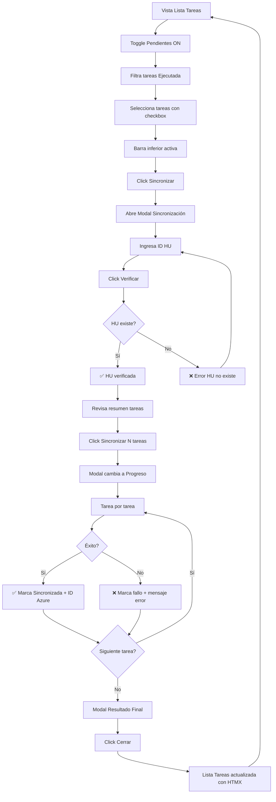
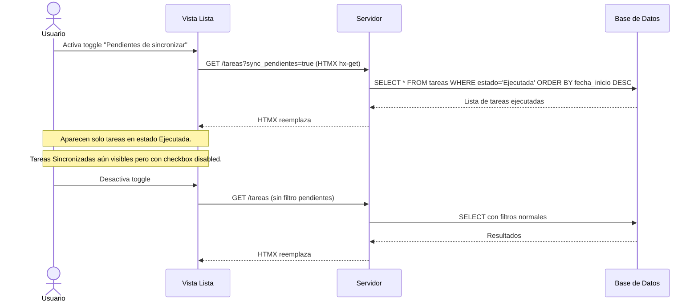
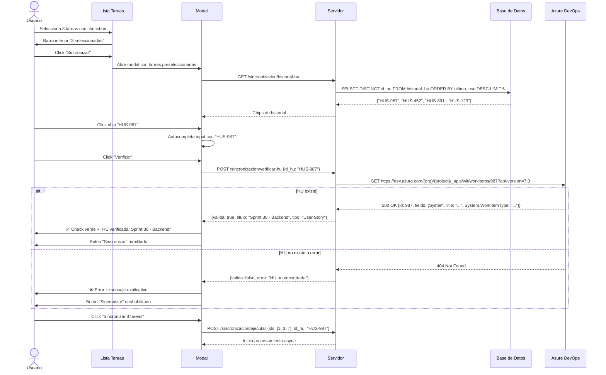
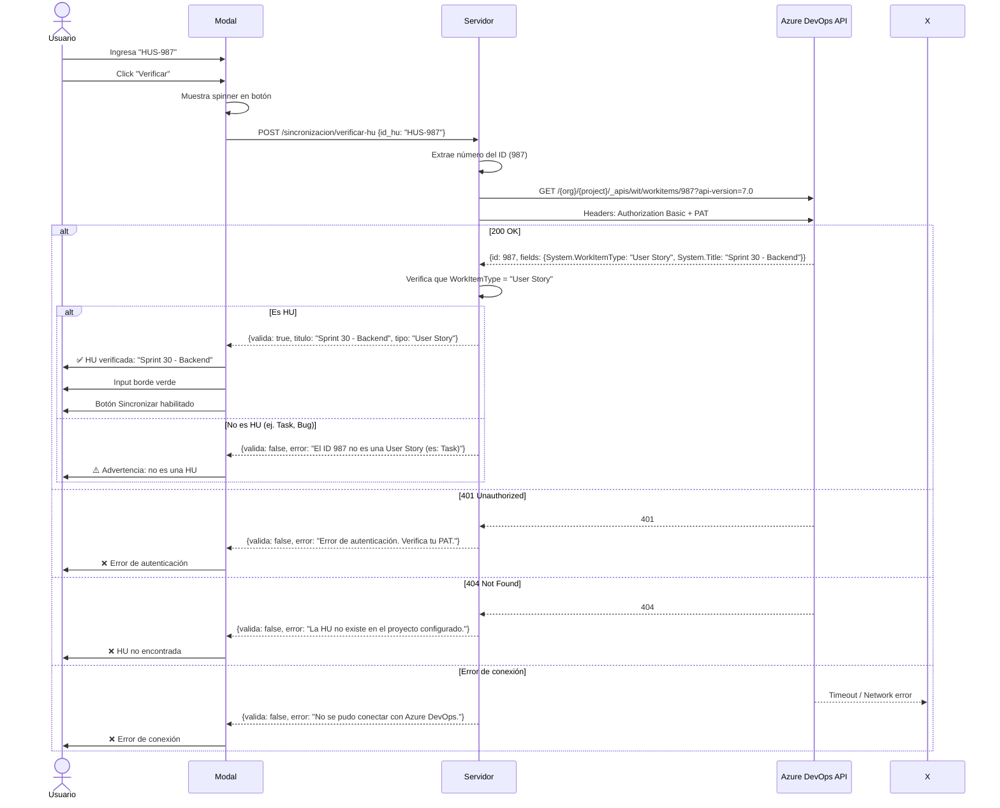
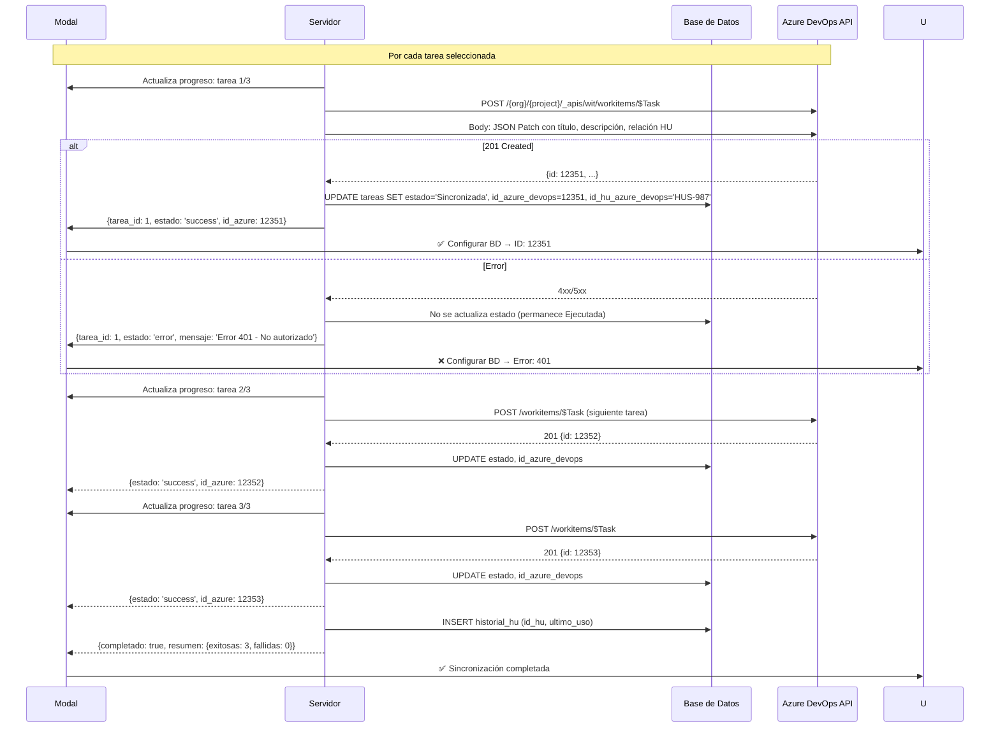
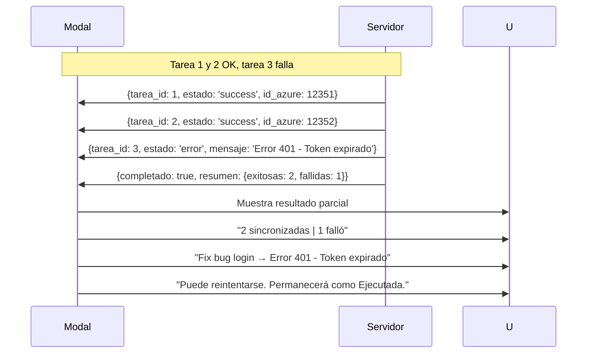
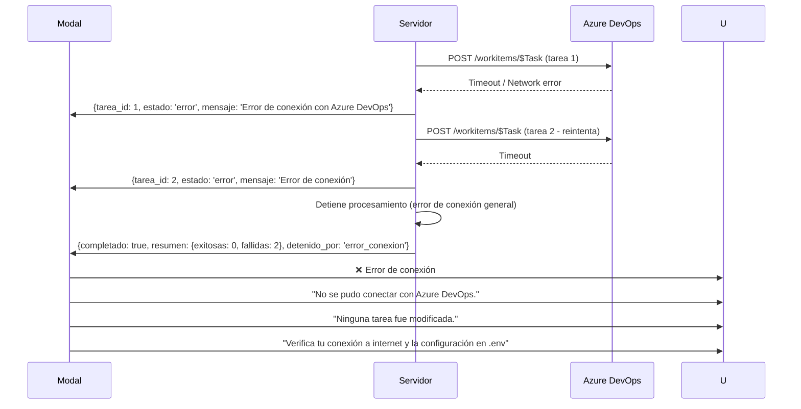

# Flujos de Navegación — Sincronización Azure

> Diagramas de interacción para la sincronización de tareas con Azure DevOps.
> **Nota:** Integrado en el módulo de Tareas, no es una página independiente.

---

## Índice

- [Flujo General Integrado](#flujo-general-integrado)
- [Flujo: Activar Filtro Pendientes](#flujo-activar-filtro-pendientes)
- [Flujo: Modal Sincronización](#flujo-modal-sincronización)
- [Flujo: Validación de HU](#flujo-validación-de-hu)
- [Flujo: Progreso de Sincronización](#flujo-progreso-de-sincronización)
- [Flujo: Manejo de Errores](#flujo-manejo-de-errores)

---

## Flujo General Integrado

---

## Flujo: Activar Filtro Pendientes

---

## Flujo: Modal Sincronización

---

## Flujo: Validación de HU (detalle)

---

## Flujo: Progreso de Sincronización

---

## Flujo: Manejo de Errores

### Error parcial

### Error de conexión (falla total)

---

## Micro-interacciones

| Interacción | Comportamiento |
|-------------|---------------|
| **Toggle Pendientes** | Slide suave del toggle. El contenido de la lista se desvanece y reaparece (HTMX swap con transición). |
| **Seleccionar tarea** | Card obtiene borde indigo-500 + fondo indigo-50/10. Checkbox se llena. |
| **Barra inferior aparece** | Slide-up desde abajo (200ms) cuando hay >= 1 selección. |
| **Barra inferior desaparece** | Slide-down (200ms) cuando selección = 0. |
| **Click chip HU** | El chip seleccionado se resalta con borde indigo. El valor se copia al input. |
| **Verificar HU** | Spinner en botón + input se pone en estado "verificando..." (borde azul + icono). |
| **Verificación exitosa** | Input borde verde + check ✅ + animación de confirmación. |
| **Verificación fallida** | Input borde rojo + shake + icono ❌. |
| **Tarea sincronizada en progreso** | Aparece con fade-in en la lista del modal. Icono ✅ animado. |
| **Resultado final** | Barra de progreso se completa al 100% con animación. Resumen aparece con fade-in. |
| **Error en tarea** | Fondo rojo suave en la fila + icono ❌ con animación de aparición. |

---

## Estados del Modal

| Estado | Descripción |
|--------|-------------|
| **Inicial** | Input HU vacío, botón "Verificar" deshabilitado, botón "Sincronizar" deshabilitado. Chips de historial visibles. |
| **HU ingresada** | Input con texto, botón "Verificar" habilitado. Sincronizar sigue deshabilitado. |
| **Verificando** | Spinner en botón, input en estado "verificando...", botones deshabilitados. |
| **HU verificada** | Input verde, check ✅, mensaje "HU verificada", botón Sincronizar habilitado. |
| **HU inválida** | Input rojo, mensaje de error, botón Sincronizar deshabilitado. |
| **Sincronizando** | Barra de progreso, lista de tareas con estado en vivo, botón Cancelar. |
| **Completado** | Resumen final, botón Cerrar. |
| **Error total** | Mensaje de error, botón Cerrar. |

---

## Documentos relacionados

- [Design System](./UI-design-system.md) — Guía de estilos y componentes
- [Mockups de Sincronización](./UI-mockups-sincronizacion.md) — Wireframes detallados del modal
- [Mockups del Módulo Tareas](./UI-mockups-tareas.md) — Lista de tareas donde se integra
- [Reglas de Negocio](../general/06-Reglas-Negocio.md) — Reglas RN-5, RN-6, RN-7, RN-19, RN-20, RN-21, RN-22, RN-23
- [ADR Stack Tecnológico](../architecture/ADR-001-stack-tecnologico.md) — FastAPI + Azure DevOps REST API

---

> **Última actualización:** 22/06/2026  
> **Versión:** 1.0  
> **Estado:** Aprobado por el usuario
