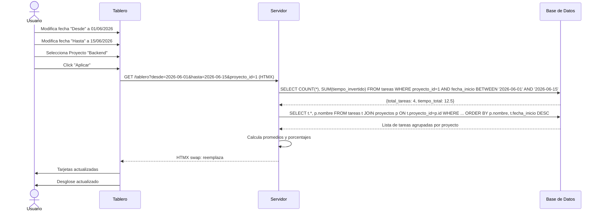
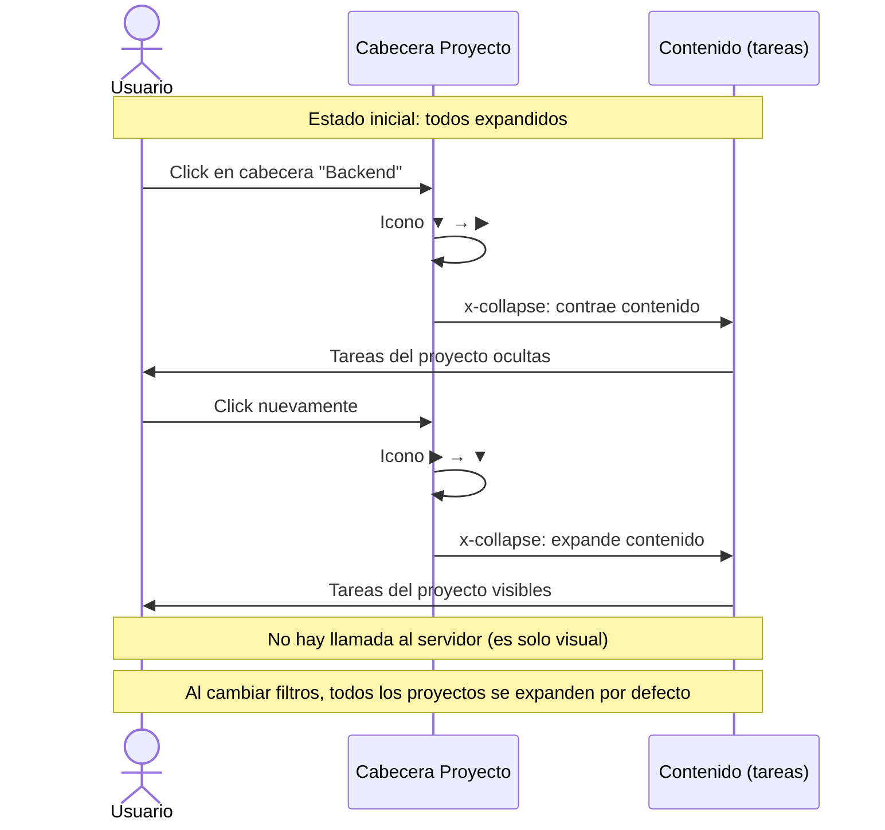

# Flujos de Navegación — Tablero de Control

> Diagramas de interacción para el Tablero de Control de métricas.

---

## Índice

- [Flujo General](#flujo-general)
- [Flujo: Aplicar Filtros](#flujo-aplicar-filtros)
- [Flujo: Colapsar/Expandir Proyectos](#flujo-colapsarexpandir-proyectos)

---

## Flujo General

```mermaid
graph TD
    A[Sidebar: Click "Tablero"] --> B[Vista Tablero]
    
    B --> C[Carga inicial]
    C --> D[Filtros default: semana actual]
    D --> E[GET /tablero con defaults]
    E --> F[Renderiza tarjetas + desglose]
    
    F --> G[Usuario modifica filtros]
    G --> H{Click "Aplicar"?}
    H -->|Sí| I[HTMX GET /tablero con nuevos filtros]
    I --> J[Actualiza tarjetas]
    J --> K[Actualiza desglose]
    K --> F
    
    F --> L[Click cabecera proyecto]
    L --> M[Toggle colapsar/expandir]
    M --> F
    
    F --> N[Click "Limpiar filtros"]
    N --> O[Reset a semana actual + Todos]
    O --> I
```

---

## Flujo: Aplicar Filtros



---

## Flujo: Colapsar/Expandir Proyectos



---

## Estado de cada pantalla

| Pantalla | Estados |
|----------|---------|
| **Tablero** | Carga inicial (skeleton) → Con datos → Vacío (sin tareas en rango) → Error de carga |

---

## Micro-interacciones

| Interacción | Comportamiento |
|-------------|---------------|
| **Aplicar filtros** | HTMX actualiza tarjetas y desglose sin recargar la página. Transición fade de 200ms. |
| **Colapsar proyecto** | Solo visual (Alpine.js `x-collapse`). Sin llamada al servidor. |
| **Reset filtros** | Botón "Limpiar filtros" restaura valores por defecto y dispara actualización HTMX. |

---

## Documentos relacionados

- [Design System](./UI-design-system.md) — Guía de estilos y componentes
- [Mockups del Tablero de Control](./UI-mockups-tablero.md) — Wireframes detallados

---

> **Última actualización:** 22/06/2026  
> **Versión:** 1.0  
> **Estado:** Aprobado por el usuario
