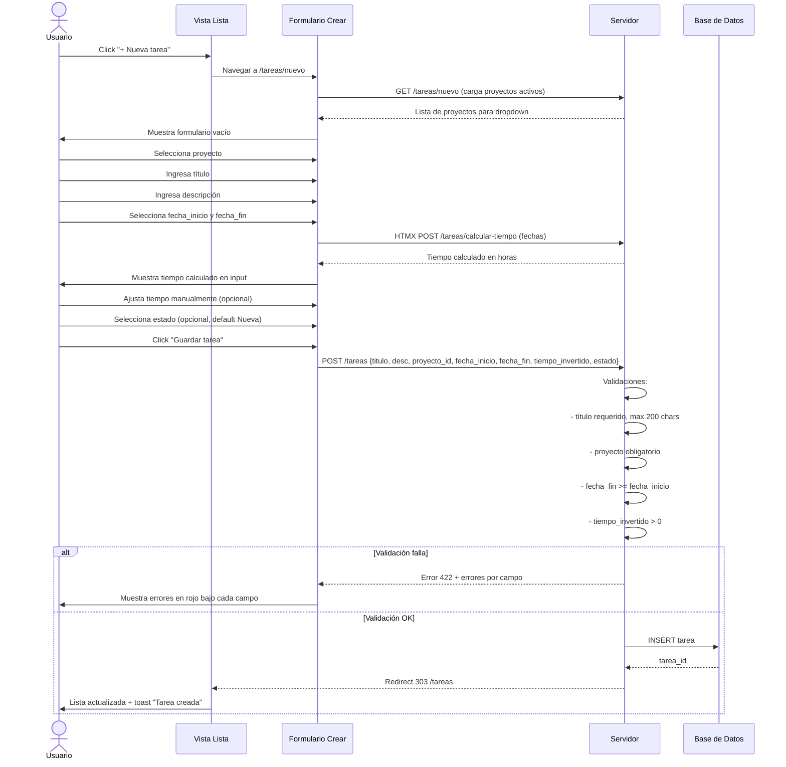
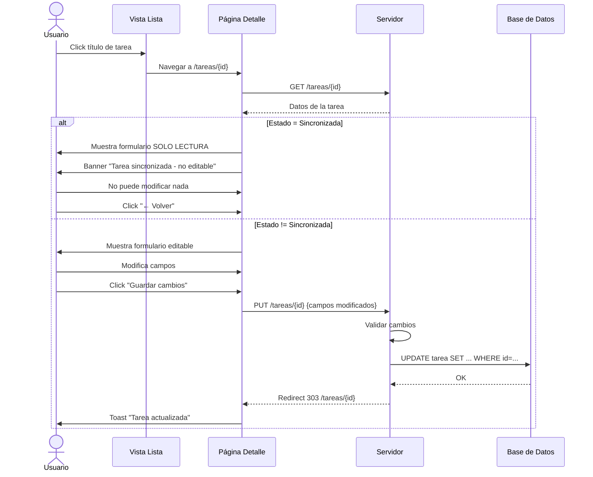
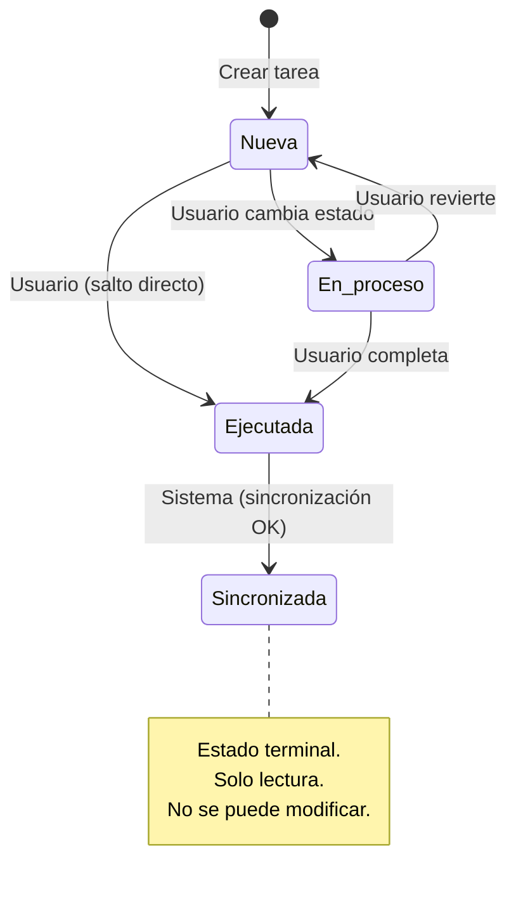
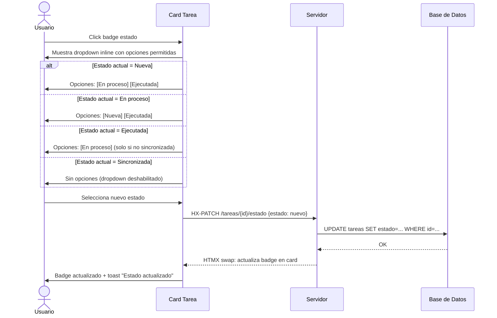
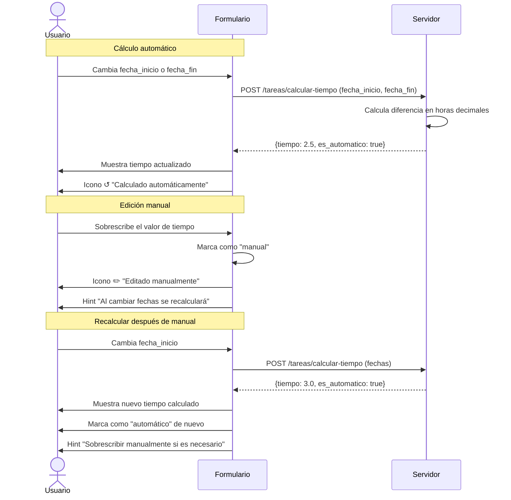
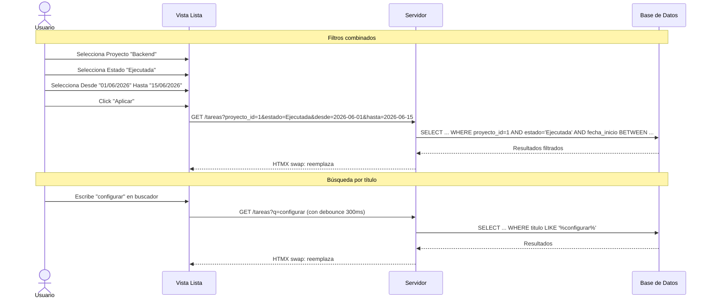
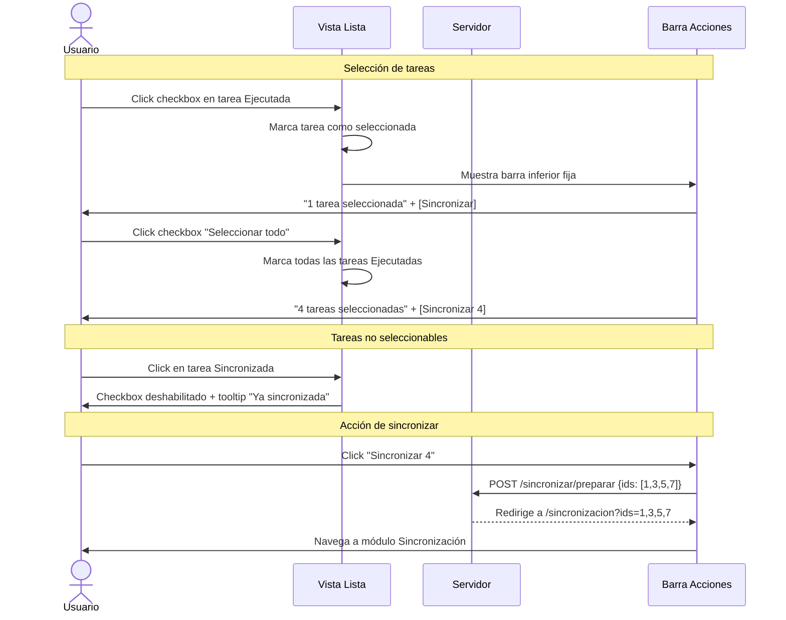

# Flujos de Navegación — Módulo Tareas

> Diagramas de navegación e interacción para el módulo de Registro de Tareas.

---

## Índice

- [Flujo General del Módulo](#flujo-general-del-módulo)
- [Flujo: Crear Tarea](#flujo-crear-tarea)
- [Flujo: Editar Tarea](#flujo-editar-tarea)
- [Flujo: Cambio de Estado](#flujo-cambio-de-estado)
- [Flujo: Tiempo Invertido (Cálculo Automático)](#flujo-tiempo-invertido-cálculo-automático)
- [Flujo: Filtrar y Buscar Tareas](#flujo-filtrar-y-buscar-tareas)
- [Flujo: Selección Múltiple para Sincronizar](#flujo-selección-múltiple-para-sincronizar)
- [Micro-interacciones](#micro-interacciones)

---

## Flujo General del Módulo

```mermaid
graph TD
    A[Sidebar: Click "Tareas"] --> B[Vista Lista Tareas]
    
    B --> C[Panel de Filtros]
    C -->|Aplicar| B
    
    B --> D[Buscador por título]
    D -->|debounce 300ms| B
    
    B --> E[Click "+ Nueva tarea"]
    E --> F[Página Crear Tarea]
    F -->|Guardar| G[Toast: "Tarea creada"]
    G --> B
    F -->|Cancelar| B
    
    B --> H[Click en título de tarea]
    H --> I[Página Detalle/Edición Tarea]
    
    I --> J[Modificar campos]
    J -->|Guardar| K[Toast: "Tarea actualizada"]
    K --> I
    J -->|Cancelar| B
    
    I --> L[Click "Eliminar"]
    L --> M[Modal Confirmación]
    M -->|Confirmar| N[Toast: "Tarea eliminada"]
    N --> B
    M -->|Cancelar| I
    
    B --> O[Seleccionar tareas con checkbox]
    O --> P[Barra acciones: "Sincronizar N"]
    P --> Q[Ir a módulo Sincronización]
    
    B --> R[Cambio rápido de estado desde card]
    R -->|Click badge estado| S[Dropdown inline]
    S -->|Seleccionar nuevo estado| T[HX-PATCH /tareas/{id}/estado]
    T -->|Éxito| B
    T -->|Error| U[Toast error]
```

---

## Flujo: Crear Tarea



---

## Flujo: Editar Tarea



---

## Flujo: Cambio de Estado



### Transiciones permitidas



---

## Flujo: Tiempo Invertido (Cálculo Automático)



### Reglas de tiempo

| Situación | Comportamiento |
|-----------|---------------|
| Usuario cambia fechas | Se recalcula automáticamente. El campo se actualiza vía HTMX. |
| Usuario escribe manualmente | Se marca con flag `tiempo_manual=true`. Icono ✏️. |
| Usuario modifica fechas después de manual | Se recalcula. Se pierde el valor manual. Advertencia: "Se recalculará el tiempo" |
| Tiempo editado manualmente en lista | Icono ✏️ al lado del valor. Tooltip explicativo. |

---

## Flujo: Filtrar y Buscar Tareas



### Especificaciones de filtros

| Filtro | Comportamiento | HTMX |
|--------|---------------|------|
| **Proyecto** | Dropdown. Al cambiar, filtra inmediatamente (sin botón Aplicar) | `hx-trigger="change"` |
| **Estado** | Dropdown. Al cambiar, filtra inmediatamente | `hx-trigger="change"` |
| **Fecha desde/hasta** | Datepickers. Requieren click en "Aplicar" | `hx-trigger="click"` en botón |
| **Búsqueda por título** | Input con debounce 300ms | `hx-trigger="keyup changed delay:300ms"` |

---

## Flujo: Selección Múltiple para Sincronizar



---

## Micro-interacciones

| Interacción | Comportamiento |
|-------------|---------------|
| **Hover en card de tarea** | Sombra pasa de `shadow-sm` a `shadow-md`. Leve elevación. |
| **Checkbox seleccionado** | Card obtiene borde indigo-500 + fondo indigo-50/10. Transición suave. |
| **Badge de estado clickeable** | Al hacer clic, se expande un dropdown inline con los estados permitidos. |
| **Cambio de estado** | El badge realiza una animación de "flash" (scale 1.1 → 1.0) al actualizarse vía HTMX. |
| **Tiempo editado manualmente** | Icono ↺ → ✏️ con animación de rotación. Tooltip informativo. |
| **Fecha inválida** | Borde rojo con shake suave si fecha_fin < fecha_inicio. |
| **Barra de selección** | Aparece desde abajo con slide-up (200ms). Desaparece si no hay selección. |
| **Tooltip en tarea sincronizada** | Al hacer hover sobre el checkbox deshabilitado: "Esta tarea ya fue sincronizada con Azure DevOps". |
| **Loading en botón Guardar** | Botón muestra spinner + "Guardando..." y se deshabilita. |

---

## Estados de cada pantalla

| Pantalla | Estados |
|----------|---------|
| **Lista de tareas** | Carga (skeleton) → Vacío (sin tareas nunca) → Vacío por filtros (con opción "Limpiar filtros") → Lista con datos → Error de carga |
| **Detalle/edición** | Carga (skeleton) → Formulario editable → Formulario solo lectura (sincronizada) → Error (tarea no encontrada) |
| **Crear tarea** | Inicial → Validación (errores inline) → Calculando tiempo (spinner) → Guardando → Éxito (redirect) → Error servidor |
| **Cambio de estado** | Dropdown cerrado → Dropdown abierto → Actualizando (spinner en badge) → Actualizado (flash) → Error |

---

## Documentos relacionados

- [Design System](./UI-design-system.md) — Guía de estilos y componentes
- [Mockups del Módulo Tareas](./UI-mockups-tareas.md) — Wireframes detallados
- [Mockups del Módulo Proyectos](./UI-mockups-proyectos.md) — Referencia del layout base
- [Reglas de Negocio](../general/06-Reglas-Negocio.md) — Reglas RN-1, RN-3, RN-4, RN-6, RN-11, RN-12, RN-13, RN-14

---

> **Última actualización:** 22/06/2026  
> **Versión:** 1.0  
> **Estado:** Pendiente de aprobación
